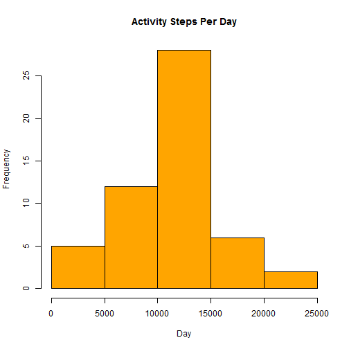
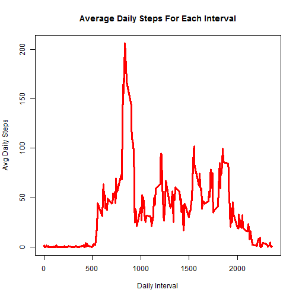
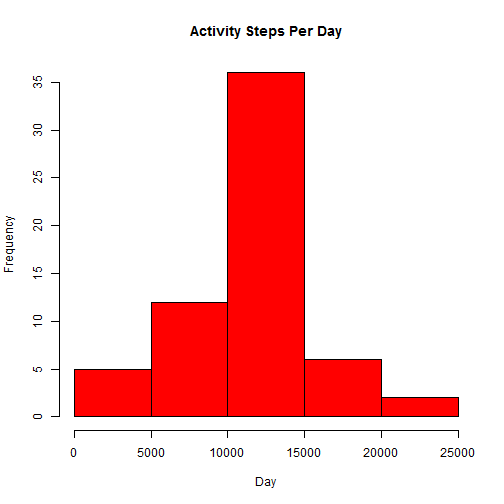

# Reproducible Research: Peer Assessment 1
========================================================
Mike Shipman 6/15/2014
--------------------------------------------------------

## Loading and preprocessing the data

This chunk of code will read the activity data into the variable "ActData" representing the activities data.

```r
#Reads activity data into df "ActData".
ActData <- read.csv("C:/Users/Mike/Documents/Coursera/Reproducible Research/activity.csv", header = TRUE)
```

The activities data was in a tidy format and no further processing was needed.

## What is mean total number of steps taken per day?

This chunk of code will create a complete data frame named "CmplActData" that only included the rows where the 'steps' variable does not have NA entered. This is needed to create the daily activity histogram and determine mean and median steps per day.

```r
#Create dataframe without rows that have NA for steps var.
CmplActData <- ActData[complete.cases(ActData), ]
```

The following code creats the average total daily steps from the complete activity dataset, so that the data table for average daily steps is created, and the mean and median average steps per day is calculated.

```r
#Create dataframe without rows that have NA for steps var.
CmplActData <- ActData[complete.cases(ActData), ]
#Gets the total steps per day mean and median of total steps per day.
ActTotStepsByDay <- aggregate(steps~date, data=CmplActData, FUN=function(x) c(total=sum(x)))
MeanStepsByDay <- mean(ActTotStepsByDay$steps)
MedStepsByDay <- median(ActTotStepsByDay$steps)
```

### 1. Histogram of average daily steps.
This code will create the following histogram of total steps taken per day data.  This histogram only reflects data that had numeric data for the steps variable reported.  

```r
#Creates the histogram of "ActTotStepsByDay"
X <- as.numeric(ActTotStepsByDay$steps)
hist(
        X, col = "orange", 
        main = "Activity Steps Per Day", 
        xlab = "Day"
        )
```

 
### 2. Mean and Median Steps Per Day.
These statistics are only derived from data that had numeric data for the steps variable reported.  
1. The mean of the average steps per day = 1.0766 &times; 10<sup>4</sup>  
2. The median of the average steps per day = 10765  

## What is the average daily activity pattern?

The code chunk calculates the daily average steps for each interval. This is needed to produce a time series plot to show the progression of activity through an average day.

```r
#Creates a time series plot of the daily activity avg across each 5 min interval.
ActMeanByInt <- aggregate(steps~interval, data=CmplActData, FUN=function(x) c(mean=mean(x)))
names(ActMeanByInt) <- c("Interval", "DailyAvg")
# Stores the maximum daily average interval.
MaxInt <- ActMeanByInt[(ActMeanByInt$DailyAvg == max(ActMeanByInt$DailyAvg)), ]
```

### 1. Time Series Plot of Avg Daily Steps per Interval

```r
plot(
        DailyAvg ~ Interval, 
        ActMeanByInt, type = "l", 
        lwd = 3, col = "red", 
        xlab = "Daily Interval", 
        ylab = "Avg Daily Steps",
        main = "Average Daily Steps For Each Interval"
        )
```

 

### 2. Interval with the most average steps per day.
The daily interval with the maximum average steps per day is interval 835.
The actual average for this interval is 206.1698 steps.

## Imputing missing values

### 1. Total Number of intervals with NA.

```r
#Compute total no of rows with NA steps
NoOfNA <- length(ActData$steps[is.na(ActData$steps)])
```
The total number of intervals that did not have steps reported is 2304

### 2 and 3. Imputing Value for NA steps reported.
To better determine the actual activity, any intervals that did not have steps reported in the dataset were replaced with the average number of steps for that particular interval. This was then updated to produce an new 'ActData' dataset with imputed steps for missing data.  The following code imputes the data into the new dataset.

```r
#Impute the avg daily steps for the steps that have "NA" in "ActData$steps" var.
IntSeq <- ActMeanByInt$Interval
for(i in IntSeq){
        IntAvg <- ActMeanByInt$DailyAvg[(ActMeanByInt$Interval == i)]
        ActData$steps[ActData$interval == i & is.na(ActData$steps)] <- IntAvg
        }
```
This shows the activity data update with imputed data filled in for NA. The first 5 steps in the original data showed NA.

```r
head(ActData)
```

```
##     steps       date interval
## 1 1.71698 2012-10-01        0
## 2 0.33962 2012-10-01        5
## 3 0.13208 2012-10-01       10
## 4 0.15094 2012-10-01       15
## 5 0.07547 2012-10-01       20
## 6 2.09434 2012-10-01       25
```

### 4. Histogram with Imputed NA values in Activity Dataset.


```r
#Gets the mean and median of the "steps" var in "ActData" by date with newly imputed data.
ActTotStepsByDay2 <- aggregate(steps~date, data=ActData, FUN=function(x) c(total=sum(x)))
MeanStepsByDay2 <- mean(ActTotStepsByDay$steps)
MedStepsByDay2 <- median(ActTotStepsByDay$steps)
#Creates the histogram of "ActTotStepsByDay"
X <- as.numeric(ActTotStepsByDay2$steps)
```

```r
hist(
        X, col = "red", 
        main = "Activity Steps Per Day", 
        xlab = "Day"
)
```

 
### Mean and Medial Steps per Day With Imputed Steps Data
1. The mean of the average steps per day = 1.0766 &times; 10<sup>4</sup>  
2. The median of the average steps per day = 10765

*Compared to the data excluding the NA from the dataset, there is not much difference in the imputed dataset.*

## Are there differences in activity patterns between weekdays and weekends?

### 1. Adding Weekday/Weekend Day Column Variable to ActData dataset.
The following code will create a new column in the imputed steps dataseet that indicates if the day was a weekday or weekend day. This is used to show a time series plot of the difference in activity progression across a average weekday and weekend day.

```r
#Add Day column to indicate weekend or weekday
Day <- weekdays(as.Date(ActData$date))
ActData <- cbind(ActData, Day)
for(i in c("Monday", "Tuesday", "Wednesday", "Thursday", "Friday")){
        ActData$Day <- gsub(i, "Weekday", ActData$Day)
}
for(i in c("Saturday", "Sunday")){
        ActData$Day <- gsub(i, "Weekend", ActData$Day)
}
```
This is a head shot of the the new imputed steps activity dataset with the new column showing the "Day" type.

```r
head(ActData)
```

```
##     steps       date interval     Day
## 1 1.71698 2012-10-01        0 Weekday
## 2 0.33962 2012-10-01        5 Weekday
## 3 0.13208 2012-10-01       10 Weekday
## 4 0.15094 2012-10-01       15 Weekday
## 5 0.07547 2012-10-01       20 Weekday
## 6 2.09434 2012-10-01       25 Weekday
```

### 2. Time Series Weekend and Weekday Steps Activity Comparison
The code below generates a lattice plot of the average steps per interval over the course of a day during the weekend day and during a weekday.

```r
#Creates a time series plot of the daily activity avg across each 5 min interval.
MeanByInt <- aggregate(steps~interval+Day, data=ActData, FUN=function(x) c(mean=mean(x)))
#Create a lattice plot of the Weekend and Weekday average steps per interval.
library(lattice)
xyplot(steps~interval|Day, data = MeanByInt, type = "l", layout = c(1, 2))
```

 

*This plot shows that weekend activity over the day is somewhat different than during the week.*
